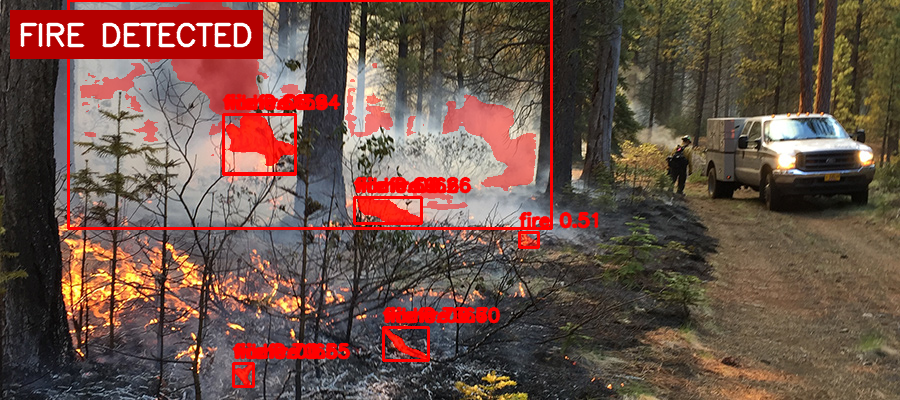
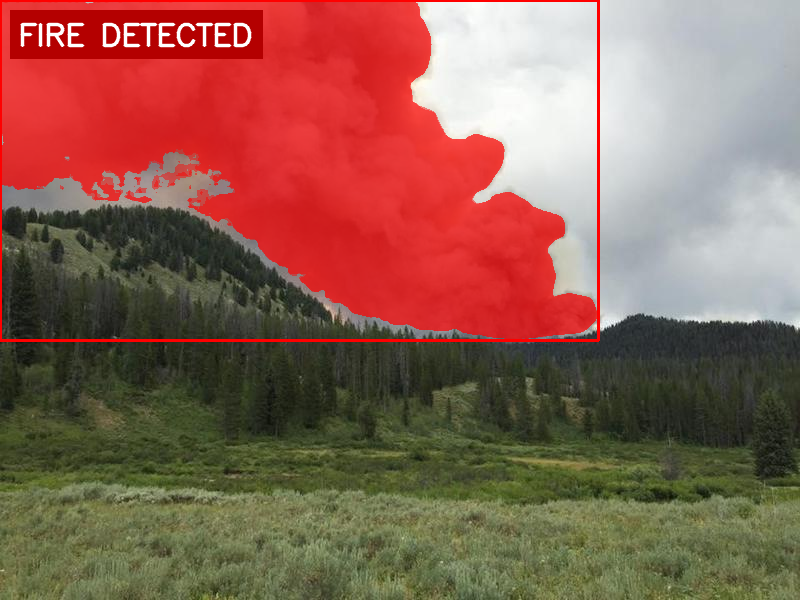
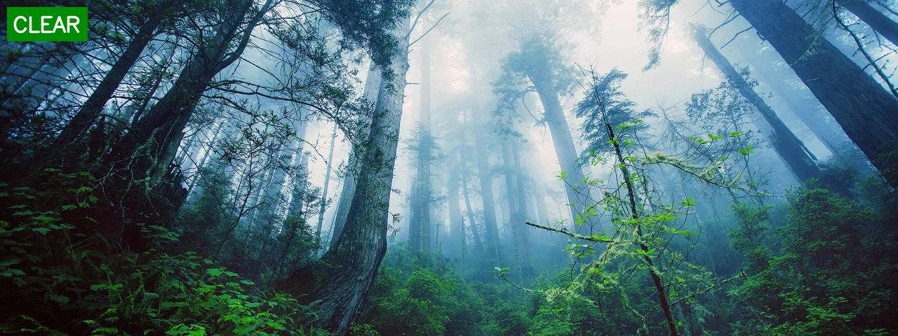
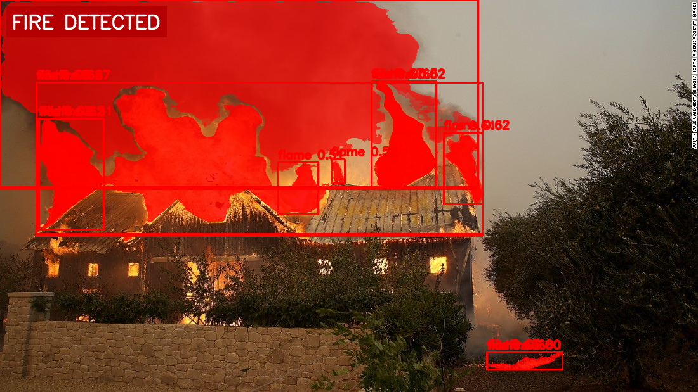
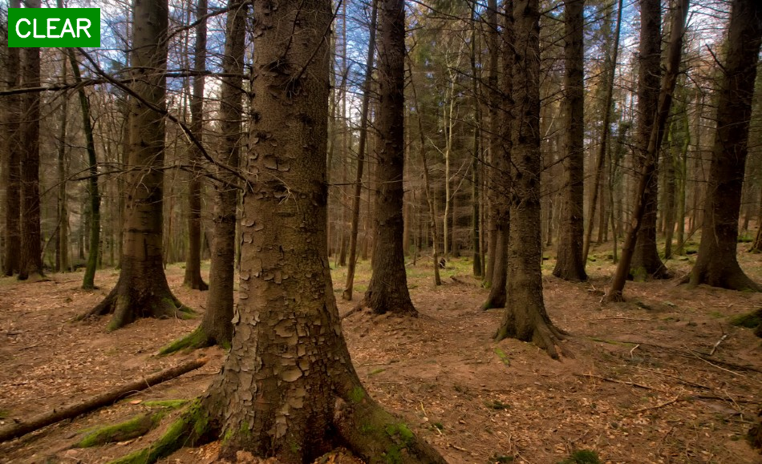

# Fire & Smoke Detection — SAM3

SAM3(Segment Anything Model 3)의 텍스트 프롬프트 기반 segmentation을 활용한 화재/연기 감지 솔루션.  
별도 탐지 모델(Grounding DINO 등) 없이 SAM3 단일 모델로 detection + segmentation을 수행한다.

## 결과 예시

| Fire | Non-Fire |
|------|----------|
|  |  |
|  |  |
|  |  |

- 좌상단 `FIRE DETECTED` (빨간 뱃지) / `CLEAR` (초록 뱃지) 로 감지 상태 표시
- 감지된 영역에 빨간 마스크 오버레이 + label/confidence 표시

## 구조

```
anomaly_detection_v1/
├── main.py          # CLI 진입점
├── detector.py      # SAM3 모델 로드 및 추론
├── visualizer.py    # 마스크 오버레이 + 상태 뱃지 시각화
├── alerter.py       # 콘솔 알림 출력
├── config.py        # 프롬프트, threshold, 경로 설정
├── fire_dataset/
│   ├── fire_images/
│   └── non_fire_images/
└── results/         # 결과 이미지 저장 경로
```

## 요구사항

```bash
pip install -r requirements.txt
```

SAM3 소스는 `../sam3-src/`에 위치해야 한다.  
모델 체크포인트는 최초 실행 시 HuggingFace(`facebook/sam3`)에서 자동 다운로드된다.

**CUDA 환경 설정** (PyTorch cu130 기준):
```bash
# conda 환경 활성화 시 자동 적용 — 최초 1회 설정
mkdir -p ~/miniconda3/envs/vision/etc/conda/activate.d
echo 'export LD_LIBRARY_PATH=/usr/local/lib/ollama/mlx_cuda_v13:$LD_LIBRARY_PATH' \
  > ~/miniconda3/envs/vision/etc/conda/activate.d/cuda.sh
```

## 사용법

```bash
# 단일 이미지
python main.py --image fire_dataset/fire_images/fire.375.png

# 단일 이미지 + 결과 폴더 지정
python main.py --image fire.jpg --output-dir results/

# 배치 모드 (--image 생략 시)
# fire_images 10장 + non_fire_images 10장 랜덤 샘플링
python main.py
python main.py --output-dir results/
```

### 옵션

| 옵션 | 기본값 | 설명 |
|------|--------|------|
| `--image` | None | 입력 이미지 경로. 생략 시 배치 모드 |
| `--threshold` | 0.5 | Confidence threshold |
| `--output-dir` | `results/` | 결과 이미지 저장 경로 |

### 출력 예시

```
Fire Detection v1.0.5 | GPU: NVIDIA GeForce RTX 3060
Batch mode: processing 20 images (10 fire + 10 non-fire)

[1/20] fire.63.png
  [fire.63.png] [ALERT] Fire detected! Confidence: 0.87
  → saved: results/result_fire.63.png

[2/20] non_fire.48.png
  [non_fire.48.png] [OK] No fire or smoke detected.
  → saved: results/result_non_fire.48.png
```

## 설정 (`config.py`)

```python
CONFIDENCE_THRESHOLD = 0.5   # 탐지 신뢰도 임계값
MASK_THRESHOLD = 0.6          # 마스크 영역 tight 조절 (높을수록 좁아짐)
MASK_ALPHA = 0.45             # 마스크 오버레이 투명도

PROMPTS = {
    "fire", "flame", "burning",
    "wildfire", "smoke", "dense smoke"
}
```

## 모델

- **SAM3 Large** (Meta, 2025.11) — `facebook/sam3`, 3.3GB
- 텍스트 프롬프트 기반 open-vocabulary segmentation
- 4백만 개 이상 개념 학습, 별도 파인튜닝 불필요
